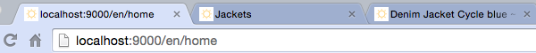
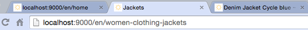
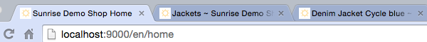
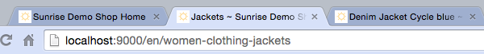

The learning goal is to get to know how the change the data of the page without just adding components. A second goal is to setup a multi controller component with dependency injection.

In this exercise the BetterTitlesComponent need to fixed to change the title of the pages.

For the home page the title (in html head, not the title in the content) should be changed to "Sunrise Demo Shop Home", for all other pages it should become "<old title> ~ Sunrise Demo Shop".

before finishing the component on home:

before finishing the component on a product detail page:

alter finishing the component on home:

alter finishing the component on a product detail page:

There is no template change required.

Still missing is to wire the [BetterTitlesComponent](BetterTitlesComponent.java) for the use in multiple controllers in [Module.java](../../app/Module.java) and also changing the PageData header title field by using a hook
