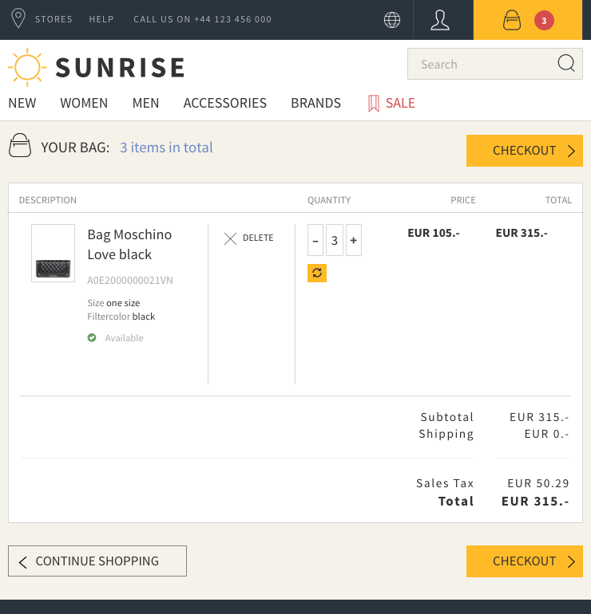
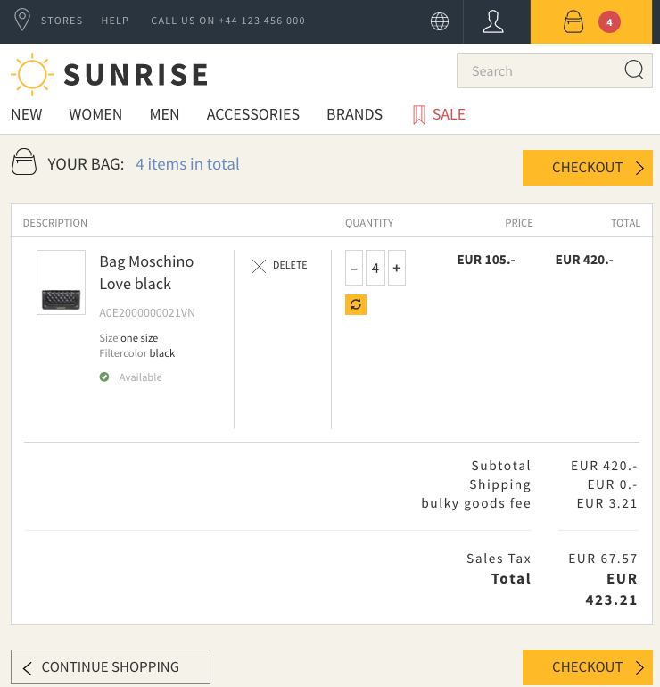

The learning goal is to add hooks to the cart updates to include extra fees or discounts which can only expressed in the shop application.

In this example an imaginary fee has to be added to the cart if the total count of line items is greater than three. Normally this would be based on product attributes with a flag or an actual sum of the weight of the items but for simplicity we use the line item count.

Normally with 3 line items or less, no extra fee is applied:

But adding a fourth item will add the fee (see "bulky goods fee" below shipping):

The [template totals.hbs](../../conf/templates/checkout/order-summary/totals.hbs) has been overridden from the theme to add this field.

The component is already registered for all controllers in.

the `CartLikeBeanFactory` has been overridden in [ShopCartLikeBeanFactory](/ShopCartLikeBeanFactory.java) and registered in [Module.java](../../app/Module.java) in to support the bulky goods data as [ShopCartLikeBean.java](/ShopCartLikeBean.java).

Still missing is the implementation of the hook to get the cart updated in [BulkyGoodsComponent](BulkyGoodsComponent.java).
