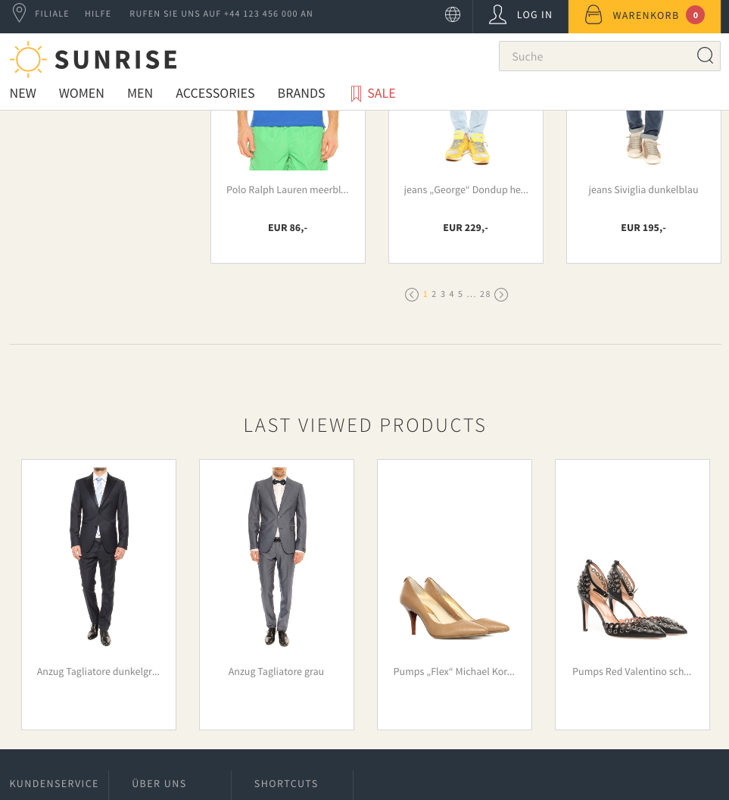

The learning goal is to use transport small values with the session and use it to display or fetch data.
Also dependency injection for required utils like the SphereClient.

In this exercise a LastViewedProductsComponent should be used to show the last 4 products which have been visited with the product detail page.
The images will be shown in the home page, the products detail page and also on the product overview page.

The result should look like this:

The [template](../../conf/templates/components/LastViewedProducts/productsView.hbs) is already implemented.

The component is already registered for the non-checkout controllers in [Module.java](../../app/Module.java).

Still missing is the implementation of the 3 hooks in [LastViewedProductsComponent](LastViewedProductsComponent.java).

The first hook is specifically called when a product variant (not just a product!) is loaded and stores the SKU in the session.

The second hook is called on every request and triggers to load the products belonging to the SKUs in the session.

The third hook is called for the page data and adds the ComponentBean to the PageContent which is part of the PageData.